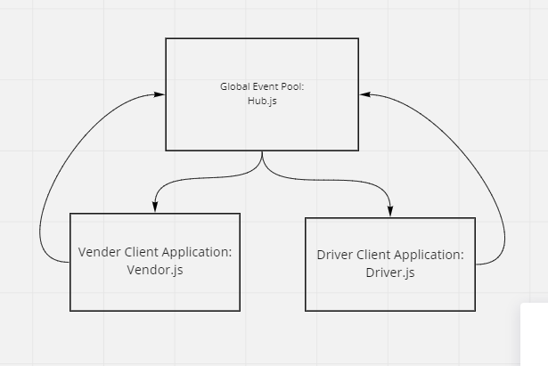

# CAPS Lab: Event Driven Applications

CAPS will simulate a delivery service where vendors (such a flower shops) will ship products using our delivery service and when our drivers deliver them, be notified that their customers received what they purchased.

## Phase 1 Requirements

### User Stories

The following user/developer stories detail the major functionality for this phase of the project.

As a vendor, I want to alert the system when I have a package to be picked up.
As a driver, I want to be notified when there is a package to be delivered.
As a driver, I want to alert the system when I have picked up a package and it is in transit.
As a driver, I want to alert the system when a package has been delivered.
As a vendor, I want to be notified when my package has been delivered.
And as developers, here are some of the development stories that are relevant to the above.

As a developer, I want to use industry standards for managing the state of each package.
As a developer, I want to create an event driven system so that I can write code that happens in response to events, in real time.

### Global Event Pool (HUB)

HUB Server

hub.js manages the event queue and live handling of all inbound events. Clients (stores and drivers) never talk to each other directly, they work through the hub, like a switchboard

Implement a Module for a Global Event Pool.
Export a single EventEmitter from the Node JS module.
Should be imported by any module that needs to notify or be alerted by other modules of an event.

Implement a Module for Managing Global Package Events.
Listens to ALL events in the Event Pool.
Logs a timestamp and the payload of every event.

```js

 EVENT { 
   "event": "pickup",
   "time": "2020-03-06T18:27:17.732Z",
   "payload": { 
     "store": "1-206-flowers",
     "orderID": "e3669048-7313-427b-b6cc-74010ca1f8f0",
     "customer": "Jamal Braun",
     "address": "Schmittfort, LA"
   }
 }

```

### Vendor and Driver Apps

Vendor and Driver Apps

For these, the client.js will be the app that runs constantly, monitoring and handling events. They’ll use the queue.js to subscribe to the hub server using a common library

Client applications will “subscribe” to the hub server’s queue for a given event. Subscribing means that the client intends for the hub server to save all messages until the client confirms receipt. Subscribing through the queue library should look like this:


```js
  queue.connect();
  queue.subscribe('delivered', (payload) => {
    // do something with the returned data (payload)
  })

```


### Vendor Client Application

Implement a Module for Managing Vendor Events.
Your implementation should use a store name as a parameter.
Wehn run, the endor module simulates a pickup event for the given store name to the Global Event Pool:
emits pickup to the global event pool.
emits a vendor order payload:


```js
 {
   "store": "<store-name>",
   "orderId": "<unique-order-id>",
   "customer": "<customer-name>",
   "address": "<city-state>"
 }

```

HINT: Have some fun by using the faker library to make up phony information.

Listens for a delivered event and responds by logging a message to the console:

### Driver Client Application

Implement a Module for Managing Driver Events.
Listens for a pickup event from the Global Event Pool and responds with the following:
Log a message to the console: DRIVER: picked up <ORDER_ID>.
Emit an ‘in-transit’ event to the Global Event Pool with the order payload.
Log a confirmation message to the console: DRIVER: delievered <ORDER_ID>.
Emit a ‘delivered` event to the Global Event Pool with the order payload.

When running, your console output should look something like this:

```js
EVENT { event: 'pickup',
  time: 2020-03-06T18:27:17.732Z,
  payload:
   { store: '1-206-flowers',
     orderID: 'e3669048-7313-427b-b6cc-74010ca1f8f0',
     customer: 'Jamal Braun',
     address: 'Schmittfort, LA' } }
DRIVER: picked up e3669048-7313-427b-b6cc-74010ca1f8f0
EVENT { event: 'in-transit',
  time: 2020-03-06T18:27:18.738Z,
  payload:
   { store: '1-206-flowers',
     orderID: 'e3669048-7313-427b-b6cc-74010ca1f8f0',
     customer: 'Jamal Braun',
     address: 'Schmittfort, LA' } }
DRIVER: delivered up e3669048-7313-427b-b6cc-74010ca1f8f0
VENDOR: Thank you for delivering e3669048-7313-427b-b6cc-74010ca1f8f0
EVENT { event: 'delivered',
  time: 2020-03-06T18:27:20.736Z,
  payload:
   { store: '1-206-flowers',
     orderID: 'e3669048-7313-427b-b6cc-74010ca1f8f0',
     customer: 'Jamal Braun',
     address: 'Schmittfort, LA' } }
...
```

### Testing

Write unit tests for each event handler function (not event triggers themselves).
Use spies to help testing your logger methods (assert that console.log was called right).

Testing Note - *The “event system” in Node.js has already been tested. What we want to test here is connectivity – is your code responding to the right events?”

### Phase 1 UML




### Credit

Help from jamiguel and eriksavage